## Goals for Today

Today, we'll use the `patchwork` package to practice combing multiple plots into organized layouts. This can be especially helpful for multi-panel figures or single figures that include side-by-side comparisons or insets.

## Loading Packages

First, we'll load our packages. We'll use `tidyverse` for data manipulation and plotting, and `patchwork` for laying out our plots.


::: {.cell layout-align="center"}

```{.r .cell-code}
library(tidyverse)
library(patchwork)
library(scales)
```
:::


## Reading in Data

Next, we'll read in our data. These are from a Tidy Tuesday looking at revenue from horror movies.


::: {.cell layout-align="center"}

```{.r .cell-code}
horror_data <- read_csv("data/horror_movies.csv")
```
:::


## Making a few plots

Next, let's make a few plots which we'll work to arrange. I'm going to make three; one showing revenue over time, another showing runtime over time, and a third showing the most popular movies.


::: {.cell layout-align="center"}

```{.r .cell-code}
theme_set(theme_classic())

horror_data %>%
  ggplot(aes(x = release_date,
             y = revenue/1000000)) + 
  geom_point(color = "grey50", alpha = 0.3) + 
  geom_smooth(method = "lm", se = FALSE, color = "black") + 
  labs(x = "Release Date", y = "Revenue (millions of dollars)") -> rev_plot

rev_plot
```

::: {.cell-output-display}
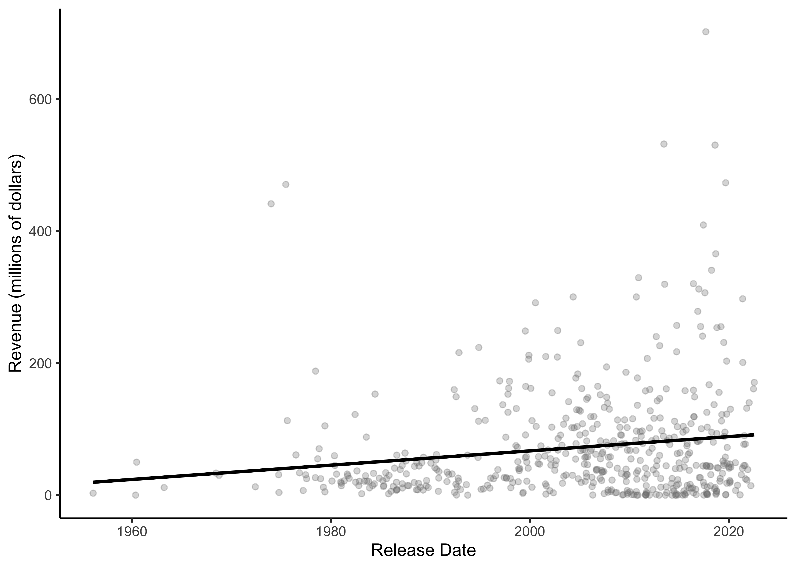{fig-align='center' width=2100}
:::
:::

::: {.cell layout-align="center"}

```{.r .cell-code}
horror_data %>%
  ggplot(aes(x = release_date,
             y = runtime)) + 
  geom_point(color = "grey50", alpha = 0.3) + 
  geom_smooth(method = "lm", se = FALSE, color = "black") + 
  labs(x = "Release Date", y = "Runtime (minutes)") -> run_plot

run_plot
```

::: {.cell-output-display}
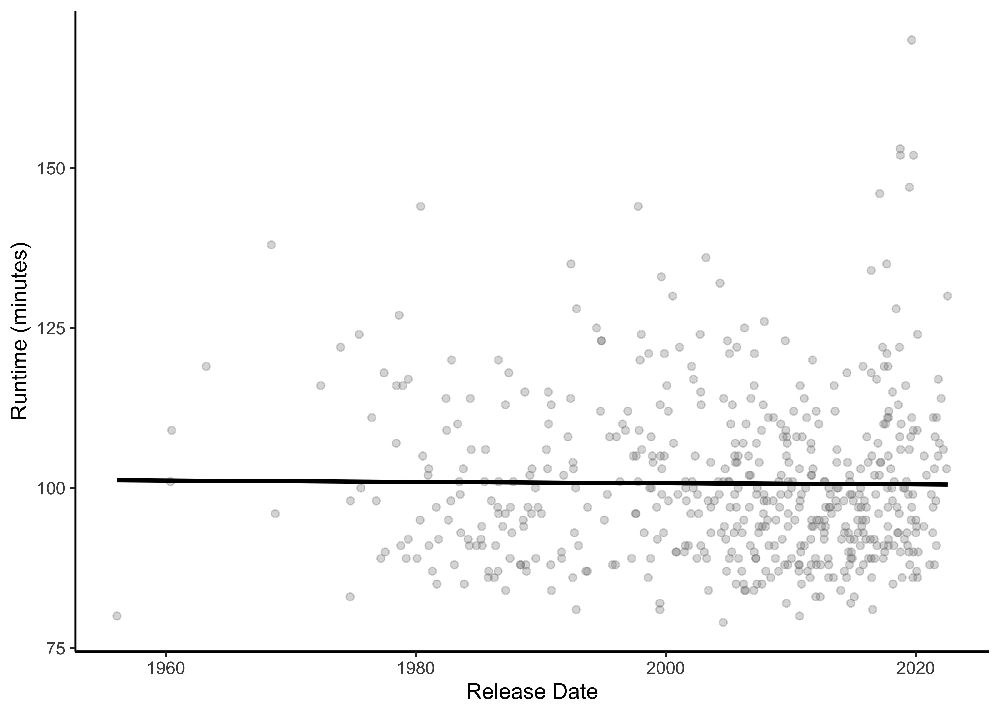{fig-align='center' width=2100}
:::
:::

::: {.cell layout-align="center"}

```{.r .cell-code}
horror_data %>%
  ggplot(aes(y = revenue/1000000)) + 
  geom_histogram() + 
  labs(x = "Count", y = "Revenue (millions of dollars)") -> rev_dist
```
:::


## Arranging with patchwork

Awesome! Now let's practice arranging these plots with `patchwork`.

At it's simplest, `patchwork` relies on arithmetic operators (+, \|, and /) to describe where plots should be placed relative to each other. For example:


::: {.cell layout-align="center"}

```{.r .cell-code}
# Both do the same thing
rev_plot + run_plot
```

::: {.cell-output-display}
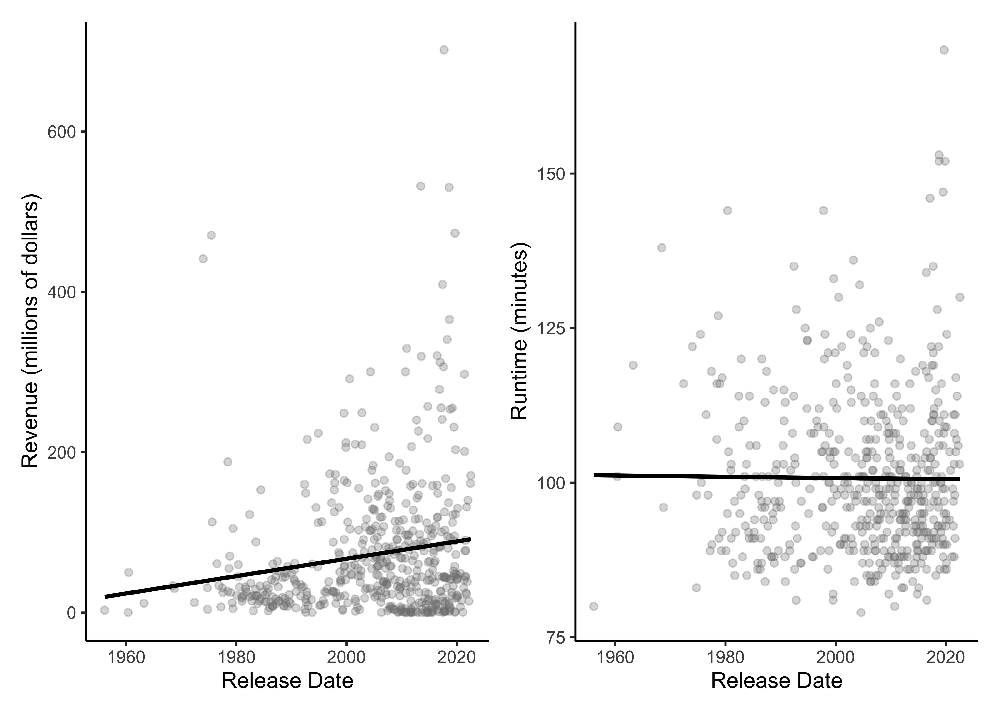{fig-align='center' width=2100}
:::

```{.r .cell-code}
rev_plot | run_plot
```

::: {.cell-output-display}
{fig-align='center' width=2100}
:::
:::


We can stack plots with the `/` operator


::: {.cell layout-align="center"}

```{.r .cell-code}
rev_plot / run_plot
```

::: {.cell-output-display}
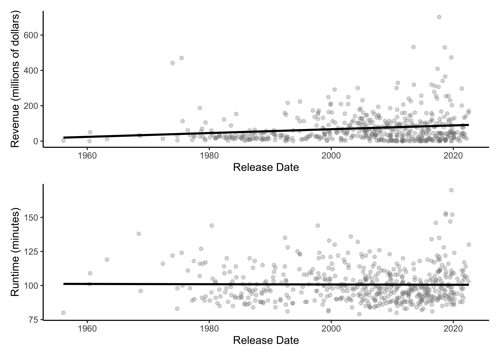{fig-align='center' width=2100}
:::
:::


You'll note that by default, `patchwork` does its best to align axes, which is nice :)

We can make our arrangements more complicated, for example:


::: {.cell layout-align="center"}

```{.r .cell-code}
rev_plot + run_plot / rev_dist
```

::: {.cell-output-display}
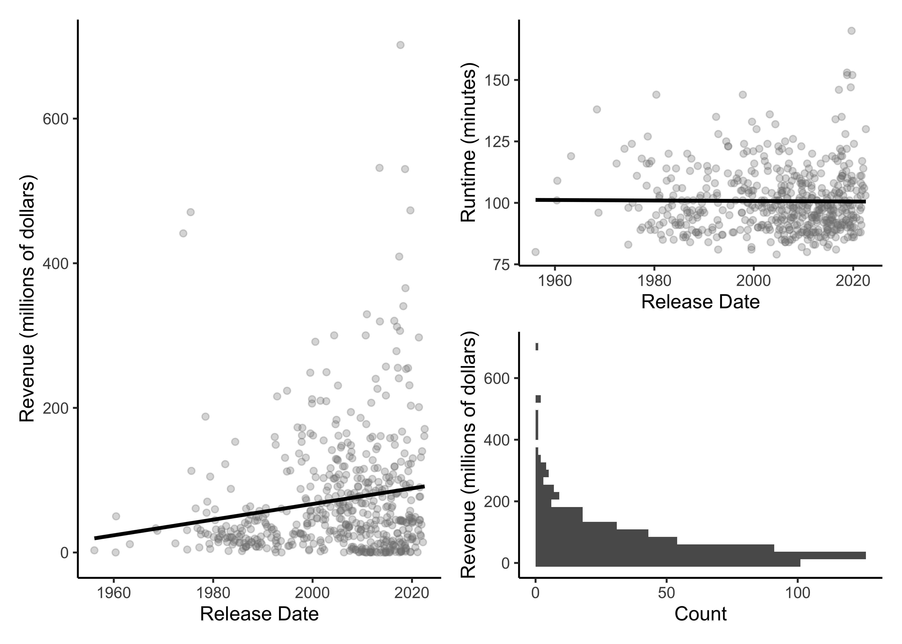{fig-align='center' width=2100}
:::
:::


Importantly, patchwork follows order of operations (so plots are stacked before they are added). We can fix this using parentheses:


::: {.cell layout-align="center"}

```{.r .cell-code}
(rev_plot + run_plot) / rev_dist
```

::: {.cell-output-display}
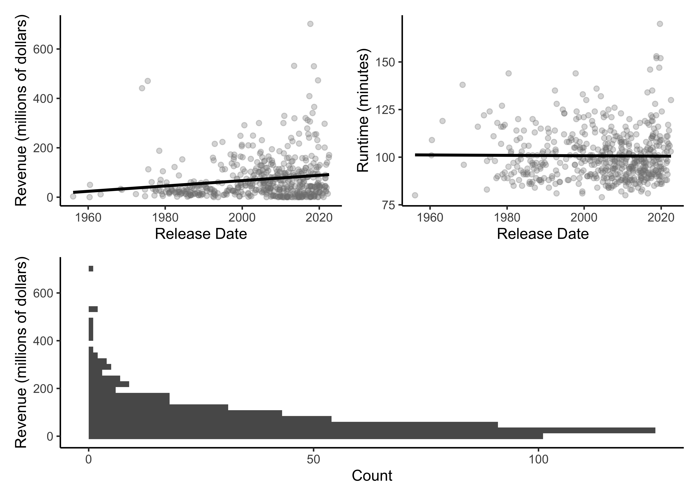{fig-align='center' width=2100}
:::
:::


We might want to mess around with sizing, so that two plots take up the same space as one plot (in patchwork, this is called "packing"). In this case, our code will change slightly depending on how we organize our plots:


::: {.cell layout-align="center"}

```{.r .cell-code}
# Pack on right side
run_plot + (rev_plot + rev_dist)
```

::: {.cell-output-display}
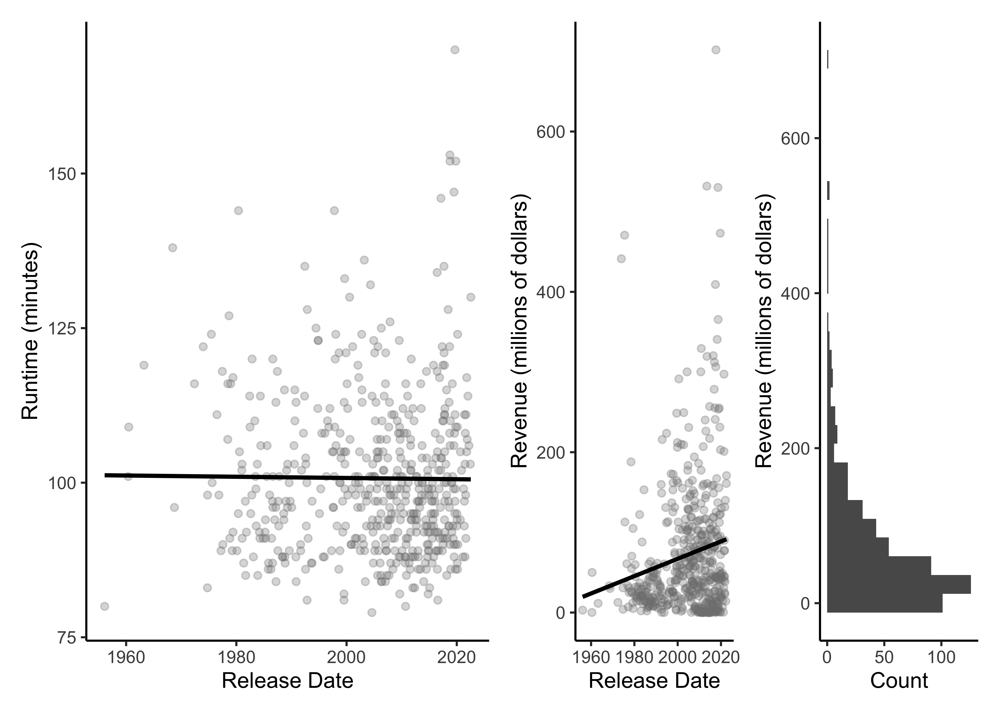{fig-align='center' width=2100}
:::

```{.r .cell-code}
# Pack on left side
(rev_plot + rev_dist) - run_plot
```

::: {.cell-output-display}
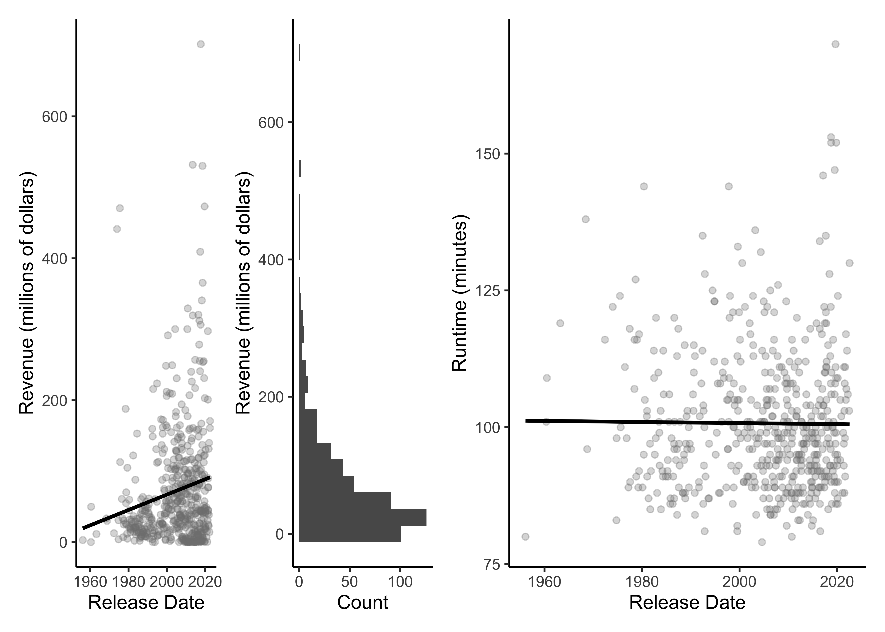{fig-align='center' width=2100}
:::
:::


Sometimes, we want empty space; we can do this with `plot_spacer`


::: {.cell layout-align="center"}

```{.r .cell-code}
(rev_plot + rev_dist) / (run_plot + plot_spacer())
```

::: {.cell-output-display}
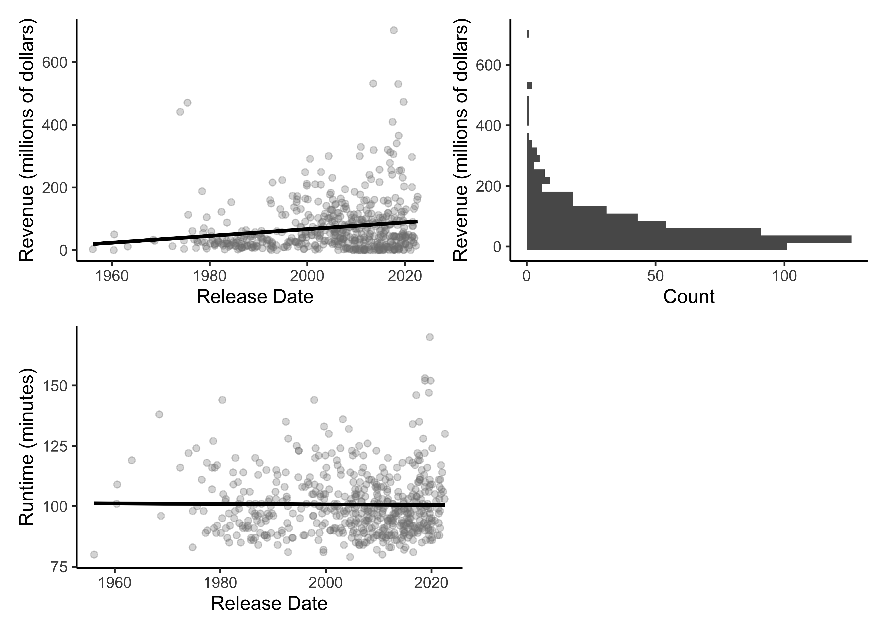{fig-align='center' width=2100}
:::
:::


Though here, we see that we've lost our vertical alignment. We can ameliorate this by combining `wrap_plots` with `plot_layout`. That way, alignment isn't occurring *within* each patch.


::: {.cell layout-align="center"}

```{.r .cell-code}
wrap_plots(rev_plot, rev_dist, run_plot) + 
  plot_layout(nrow = 2)
```

::: {.cell-output-display}
{fig-align='center' width=2100}
:::
:::


`plot_layout` is powerful, in that we can also mess with relative heights and widths.


::: {.cell layout-align="center"}

```{.r .cell-code}
wrap_plots(rev_plot, rev_dist, run_plot) + 
  plot_layout(nrow = 2,
              widths = c(1,.2))
```

::: {.cell-output-display}
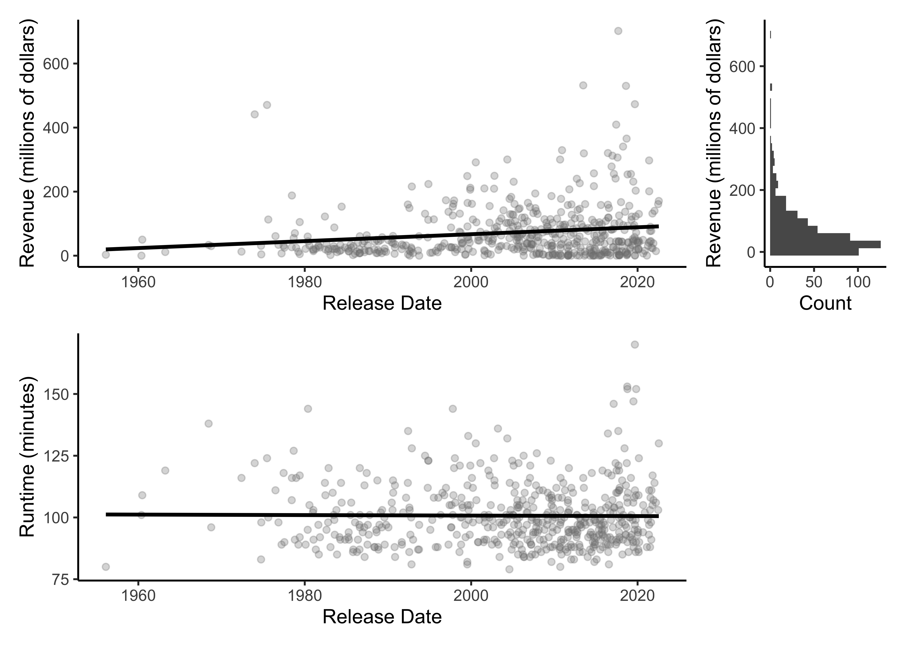{fig-align='center' width=2100}
:::
:::


Perhaps we even want to clean up these plots, such that we don't have extra axis labels when not needed.


::: {.cell layout-align="center"}

```{.r .cell-code}
rev_plot + 
  theme(axis.title.x = element_blank(),
        axis.text.x = element_blank()) -> new_rev_plot

rev_dist + 
  theme(axis.title = element_blank(),
        axis.text = element_blank(),
        axis.ticks = element_blank(),
        axis.line = element_blank()) -> new_rev_dist

wrap_plots(new_rev_plot, new_rev_dist, run_plot) + 
  plot_layout(nrow = 2,
              widths = c(1,.2))
```

::: {.cell-output-display}
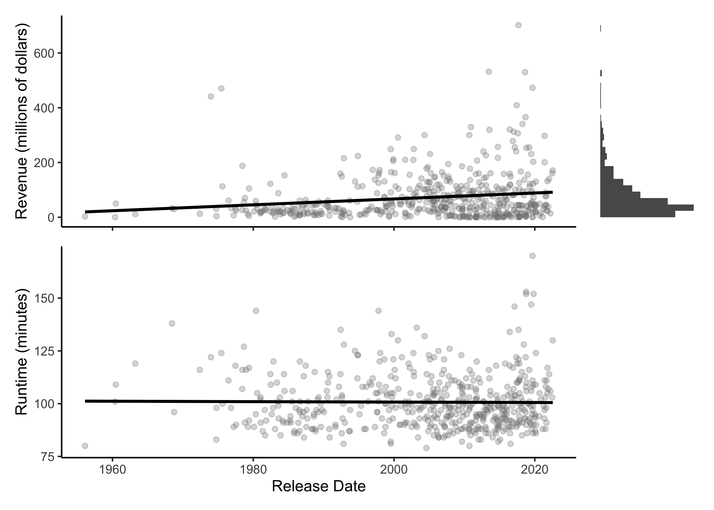{fig-align='center' width=2100}
:::
:::


We can also add labels, such as you would see in a figure legend:


::: {.cell layout-align="center"}

```{.r .cell-code}
wrap_plots(new_rev_plot, new_rev_dist, run_plot) + 
  plot_layout(nrow = 2,
              widths = c(1,.2)) + 
  plot_annotation(tag_levels = "A")
```

::: {.cell-output-display}
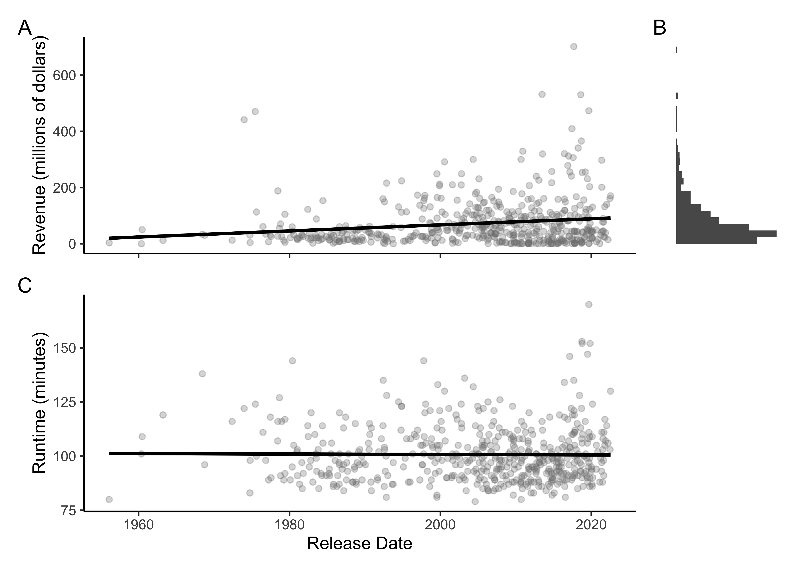{fig-align='center' width=2100}
:::
:::


Patchwork also allows insets.


::: {.cell layout-align="center"}

```{.r .cell-code}
flipped_rev_dist <- rev_dist + coord_flip()

rev_plot + 
  inset_element(flipped_rev_dist,
                left = 0.05,
                right = .4,
                bottom = .3,
                top = 1)
```

::: {.cell-output-display}
{fig-align='center' width=2100}
:::
:::


There is a ton more flexibility that we haven't touched on, but patchwork has excellent documentation that I encourage you to read through [here](https://patchwork.data-imaginist.com/index.html).
