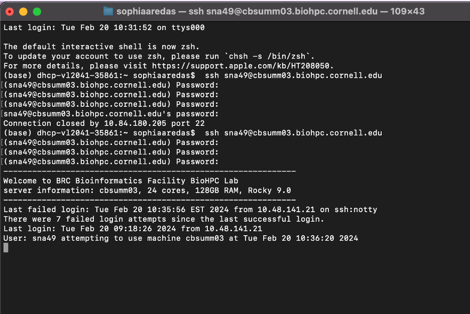
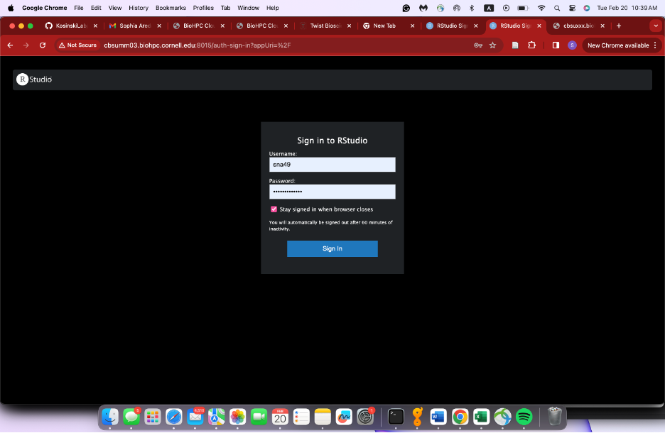
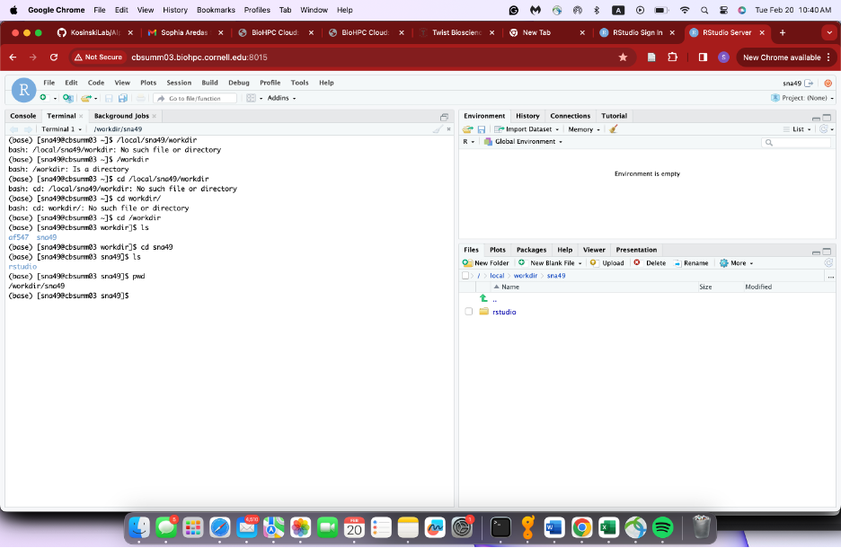
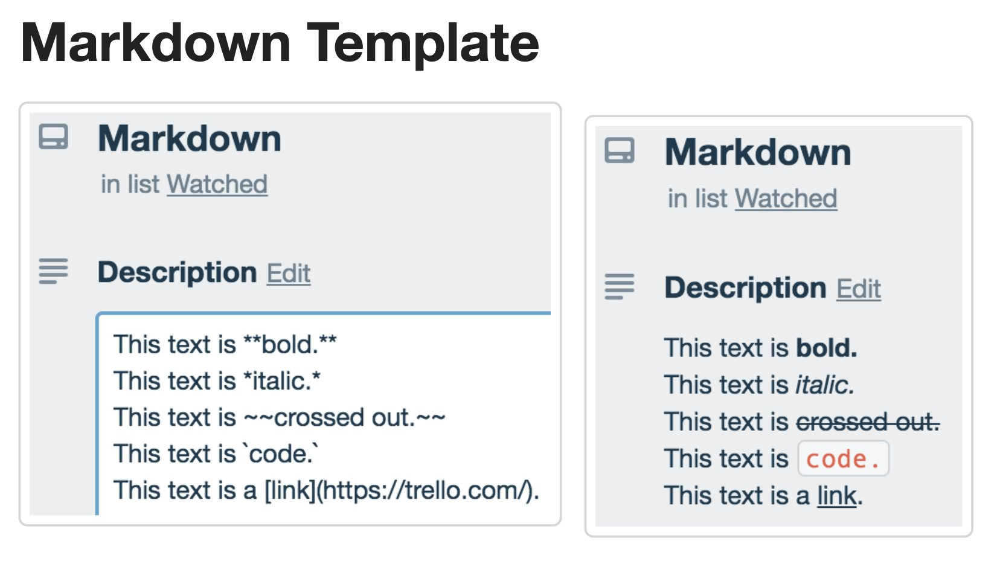

# BioHPC Basics

Logging into the BioHPC may seem like a daunting task but its not so bad once you get the hang of it! This tutorial will show how to login if your lab owns a server or if your lab rents time.

Below are the list of things that we will accomplish today:

I. The beginning of this tutorial will show how to login the server. Specifically we will be logging into the Rstudio server.

II\. Creating RMarkdown file. This is how we can take notes and keep track of our bioinformatic analysis!

III\. Accessing programs from the BioHPC installed software as well as online programs.

### I. Logging into the Rstudio server

Both steps of logging into the server whether you use rented time or your lab owns a server is really similar but there are some differences in order to access!

We will first start with how to log into the rented server. If you only care about how to login the server that your lab owns please scroll down to the next heading:)

If you are not sure if your lab owns their server or rents time, ask your PI or someone in the lab who might use the server!

#### Logging into the rented server

1\. Create a biohpc account on the biohpc website or if you have an existing biohpc account log in. Here is the link for logging in: <https://biohpc.cornell.edu/login_bio.aspx?ReturnURL=/lab/projects.aspx>

2\. Once you are logged into the website, go to the reservations page. 

3.  Choose a server type. This will depend on what program you are running but **medium gen1** is good for running basic needs. **If you need anything more computationally powerful you will need to use a GPU server** (this would be if you wanted to run a program like alphapulldown. if the program is installed on the BioHPC it will tell you if you need a special server.)

4.  Reserve time on the server.

    Be sure to reserve enough time to run your analysis. Once your time expires all your information will eventually be deleted from the server so do your best to save your important files!

    Note: You will add the amount of time that you intend to use the server for as well as picking the machine (ie: cbsumm##). Pick whatever machine is available.

    

5.  Now that you have reserved time on the server, open up your terminal and type the following command to connect (be sure to fill in the information accordingly):

    example:

    ssh sna49\@cbsumm03.biohpc.cornell.edu

This will vary based on your cornell ID as well as the machine you have selected.

6.  Then enter your biophc password. This is an embarrassing attempt but this is what it will look like when you successfully type in your password. Now we see we are logged into the server!

To me this is scary and intimidating. working in the terminal like this is definitely doable but I personally prefer to work in Rstudio.

7.  Log into Rstudio server (instructions from biohpc <https://biohpc.cornell.edu/lab/userguide.aspx?a=software&i=266>)
    1.  copy and paste command: "/programs/rstudio_server/mv_dir"

        1.  This is to keep the big session data files under our working directory. This will be important later but do not work in your home directory or you will be charged if your home directory gets too full

    2.  copy and paste command: "/programs/rstudio_server/rstudio_start"

        1.  You might get a message that someone else is running Rstudio. This means that another person on your server is running Rstudio so you can skip to step 4

    3.  from a browser on your computer go to copy and paste this link to your browser: "[http://cbsuxxxxxx.biohpc.cornell.edu:8016](http://cbsuxxxxxx.biohpc.cornell.edu:8016%22)"

        1.  Be sure to correctly fill in the correct information like what is your machine that you are running on

        2.  If for some reason you do not get to the right Rstudio screen and instead it takes you to a Python Jupyter notebook or something that does not look like Rstudio you can change the port number. In this case "8016" is our port but if this number does not work then you can enter a new number between "8009" and "8039". But in most cases the 8016 port will work just fine!

    4.  Then enter your username and password used for biohpc on the login screen.

        

    5.  Once you are logged in you will see a screen like this:

        

#### Logging into your lab's owned server (also called hosted server)

1.  Create a biohpc account on the biohpc website or if you have an existing biohpc account log in. Here is the link for logging in: <https://biohpc.cornell.edu/login_bio.aspx?ReturnURL=/lab/projects.aspx>

Note: if your lab owns their own server you only need to do this step once. If you already have an account skip this step and go to step 2.

2.  Open up your terminal and type in something like this on the command line:

    ssh userID\@cbsuXXXX.biohpc.cornell.edu

Note: be sure to add in your user ID and the correct name of your labs server.

3.  Then use the password that you made for your BioHPC account
4.  So we can continue working in the terminal but I prefer to work in the Rstudio server so lets login there!
5.  Log into Rstudio server (instructions from biohpc <https://biohpc.cornell.edu/lab/userguide.aspx?a=software&i=266>)
    1.  copy and paste command: "/programs/rstudio_server/mv_dir"

        1.  This is to keep the big session data files under our working directory. This will be important later but do not work in your home directory or you will be charged if your home directory gets too full

    2.  copy and paste command: "/programs/rstudio_server/rstudio_start"

        1.  You might get a message that someone else is running Rstudio. This means that another person on your server is running Rstudio so you can skip to step 4

    3.  from a browser on your computer go to copy and paste this link to your browser: "[http://cbsuxxxxxx.biohpc.cornell.edu:8016](http://cbsuxxxxxx.biohpc.cornell.edu:8016%22)"

        1.  Be sure to correctly fill in the correct information like what is your machine that you are running on

        2.  If for some reason you do not get to the right Rstudio screen and instead it takes you to a Python Jupyter notebook or something that does not look like Rstudio you can change the port number. In this case "8016" is our port but if this number does not work then you can enter a new number between "8009" and "8039". But in most cases the 8016 port will work just fine!

    4.  Then enter your username and password used for biohpc on the login screen.

        

    5.  Once you are logged in you will see a screen like this:

        

Yay now we have successfully logged in \<3 Now lets get into the next portion of the tutorial

### II. Creating an RMarkdown file

So now we see our Rstudio screen and now what do we do?

1.  So first we need to go to our terminal and make sure that we are not in our home directory. Please do not ever run things in your home directory, you only ever want to run things in your workdir. If your storage exceeds the limit in your home directory you will get charged.

    So lets get to our working directory.

In your Rstudio terminal type in the following command:

cd /local/workdir/\<userID\>

2.  Now that we are in our working directory lets make files in our terminal

still in the terminal type in:

mkdir Analysis

note: you can name your folder whatever you want based on your needs

3.  Now lets change directory (cd) to our newly created Analysis folder

in terminal type:

cd Analysis

Note: you can use tab to complete your word it is really helpful when things get long!

4.  Great now that we are in our Analysis folder lets make an RMarkdown file.

Now we will not be in the terminal for this part but we can either go to the File button on our top part of screen or in our right hand pannel we can click on the button called "New Blank File". Either way if you click File or New Blank File we will click on the option to create an RMarkdown file.

Once you click on the file give it a name like "HackyHour20240806"

Rmarkdown files are great! They allow us to keep track of our bioinformatic analysis so lets fill in our file

5.  Lets add a title for our file. To add headings in RMarkdown files we will use the "\#" key. The less "#s" the bigger the heading will be. Lets try that out.

In our HackyHour20240806.Rmd file that we just created lets play around with titles

Without the quotations type in:

"\# Introduction"

"Then type in a little blurb of your choosing like here is where we will do our bioinformatic analysis"

"\## Date"

"\### Running our first program: geNomad"

"ok so we will not actually run these programs but for the vibes we will pretend how we can set up the documents"

"and yay geNomad is on the BioHPC!"

"\### Running our second program: foldseek"

"naur foldseek is not on the biohpc server but we can get it from online"

Note: we can make stuff pop out by bolding, italicizing, crossing out, etc. Here is a handy cheat sheet for the different things you can do in RMarkdown. I wont be going over it today but if you were ever curious please refer to this!

